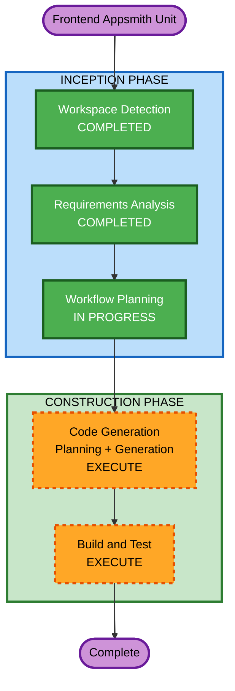

# Execution Plan - Frontend Appsmith Unit

## Detailed Analysis Summary

### Transformation Scope
- **Transformation Type**: New frontend unit (Appsmith Cloud) connecting to existing Domain Service
- **Primary Changes**: Build 4-page Appsmith app + ngrok tunnel setup
- **Related Components**: Domain Service (existing, no changes needed)

### Change Impact Assessment
- **User-facing changes**: Yes - New frontend application for end users
- **Structural changes**: No - Domain Service architecture unchanged
- **Data model changes**: No - Using existing API contracts
- **API changes**: No - All APIs already exist and tested
- **NFR impact**: Minimal - Only deployment model change (Cloud vs Docker)

### Risk Assessment
- **Risk Level**: Low
- **Rollback Complexity**: Easy (Appsmith app can be deleted/reimported)
- **Testing Complexity**: Simple (manual testing via Appsmith UI)

---

## Workflow Visualization



### Text Alternative
```
Start → Workspace Detection (COMPLETED) → Requirements Analysis (COMPLETED) → Workflow Planning (IN PROGRESS) → Code Generation (EXECUTE) → Build and Test (EXECUTE) → Complete
```

---

## Phases to Execute

### INCEPTION PHASE
- [x] Workspace Detection (COMPLETED - Brownfield, existing project)
- [x] Requirements Analysis (COMPLETED - frontend-appsmith-requirements.md approved)
- [x] Workflow Planning (IN PROGRESS)
- [x] User Stories - SKIP
  - **Rationale**: Requirements đã đủ rõ ràng, chỉ có 1 user type (CBPT/Manager), scope POC đơn giản
- [x] Application Design - SKIP
  - **Rationale**: Không có component mới cần thiết kế. Appsmith là lowcode platform, không cần component architecture. Domain Service đã có sẵn.
- [x] Units Generation - SKIP
  - **Rationale**: Đây là single unit (1 Appsmith app). Không cần decompose thêm.

### CONSTRUCTION PHASE
- [x] Functional Design - SKIP
  - **Rationale**: Appsmith là lowcode platform, không có business logic code. Logic nằm ở Domain Service (đã hoàn thành). Frontend chỉ gọi API và render UI.
- [x] NFR Requirements - SKIP
  - **Rationale**: Không có NFR mới. Appsmith Cloud xử lý hosting. Ngrok là temporary tunnel cho POC.
- [x] NFR Design - SKIP
  - **Rationale**: NFR Requirements skipped → NFR Design skipped.
- [x] Infrastructure Design - SKIP
  - **Rationale**: Appsmith Cloud managed. Ngrok là CLI tool đơn giản. Không cần infrastructure design.
- [ ] Code Generation - EXECUTE
  - **Rationale**: Tạo Appsmith JSON export file + step-by-step guide + ngrok setup guide
- [ ] Build and Test - EXECUTE
  - **Rationale**: Hướng dẫn import app, test từng page, verify API connectivity

---

## Code Generation Plan (Preview)

### Part 1 - Planning (sẽ chi tiết ở stage Code Generation)
1. Ngrok setup guide
2. Appsmith Cloud datasource configuration
3. Page 1: Lead List (Table widget + API query)
4. Page 2: Lead Detail (Detail view + status update)
5. Page 3: Lead Allocation (Multi-select + Modal + API)
6. Page 4: Dynamic Form (JSON Form rendering + conditional fields)
7. Navigation & Layout
8. Appsmith JSON export file

### Part 2 - Generation
- Tạo Appsmith application JSON export
- Tạo step-by-step guide markdown
- Tạo ngrok setup guide

---

## Deliverables

| # | Deliverable | Format | Location |
|---|---|---|---|
| 1 | Ngrok Setup Guide | Markdown | frontend-appsmith/docs/ngrok-setup.md |
| 2 | Appsmith Build Guide | Markdown | frontend-appsmith/docs/appsmith-build-guide.md |
| 3 | Appsmith JSON Export | JSON | frontend-appsmith/appsmith-export.json |
| 4 | Platform Evaluation Notes | Markdown | frontend-appsmith/docs/evaluation-notes.md |

---

## Success Criteria
- **Primary Goal**: Appsmith Cloud app hoạt động end-to-end với Domain Service qua ngrok
- **Key Deliverables**: JSON export importable + step-by-step guide
- **Quality Gates**:
  - Lead List hiển thị đúng data từ API
  - Lead Detail hiển thị chi tiết + cập nhật trạng thái thành công
  - Lead Allocation phân bổ thành công
  - Dynamic Form render đúng từ schema + submit thành công

## Estimated Timeline
- **Total Stages to Execute**: 2 (Code Generation + Build and Test)
- **Estimated Duration**: 1 session
