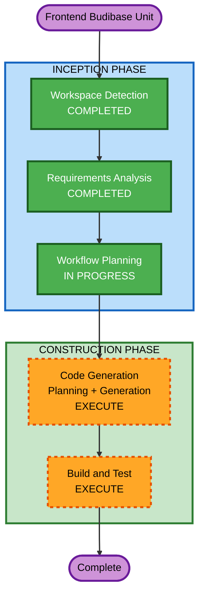

# Execution Plan - Frontend Budibase Unit

## Detailed Analysis Summary

### Transformation Scope
- **Transformation Type**: New frontend unit (Budibase Cloud) connecting to existing Domain Service
- **Primary Changes**: Build 2-screen Budibase app + reuse ngrok tunnel
- **Related Components**: Domain Service (existing, no changes needed)

### Change Impact Assessment
- **User-facing changes**: Yes - New frontend application for end users (Budibase version)
- **Structural changes**: No - Domain Service architecture unchanged
- **Data model changes**: No - Using existing API contracts
- **API changes**: No - All APIs already exist and tested
- **NFR impact**: Minimal - Only deployment model (Budibase Cloud vs Appsmith Cloud)

### Risk Assessment
- **Risk Level**: Low
- **Rollback Complexity**: Easy (Budibase app can be deleted/reimported)
- **Testing Complexity**: Simple (manual testing via Budibase UI)

---

## Workflow Visualization



### Text Alternative
```
Start → Workspace Detection (COMPLETED) → Requirements Analysis (COMPLETED) → Workflow Planning (IN PROGRESS) → Code Generation (EXECUTE) → Build and Test (EXECUTE) → Complete
```

---

## Phases to Execute

### INCEPTION PHASE
- [x] Workspace Detection (COMPLETED - Brownfield, existing project)
- [x] Requirements Analysis (COMPLETED - frontend-budibase-requirements.md approved)
- [x] Workflow Planning (IN PROGRESS)
- [x] User Stories - SKIP
  - **Rationale**: Requirements đã đủ rõ ràng, scope chỉ 2 screens, POC đơn giản
- [x] Application Design - SKIP
  - **Rationale**: Không có component mới cần thiết kế. Budibase là lowcode platform, không cần component architecture. Domain Service đã có sẵn.
- [x] Units Generation - SKIP
  - **Rationale**: Đây là single unit (1 Budibase app). Không cần decompose thêm.

### CONSTRUCTION PHASE
- [x] Functional Design - SKIP
  - **Rationale**: Budibase là lowcode platform, không có business logic code. Logic nằm ở Domain Service (đã hoàn thành). Frontend chỉ gọi API và render UI.
- [x] NFR Requirements - SKIP
  - **Rationale**: Không có NFR mới. Budibase Cloud xử lý hosting. Ngrok dùng chung với Appsmith.
- [x] NFR Design - SKIP
  - **Rationale**: NFR Requirements skipped → NFR Design skipped.
- [x] Infrastructure Design - SKIP
  - **Rationale**: Budibase Cloud managed. Ngrok đã setup. Không cần infrastructure design.
- [ ] Code Generation - EXECUTE
  - **Rationale**: Tạo Budibase JSON export file + step-by-step guide + datasource setup guide
- [ ] Build and Test - EXECUTE
  - **Rationale**: Hướng dẫn import app, test từng screen, verify API connectivity

---

## Code Generation Plan (Preview)

### Part 1 - Planning (sẽ chi tiết ở stage Code Generation)
1. Datasource setup guide (reuse ngrok)
2. Screen 1: Lead List (Table component + API query)
3. Screen 2: Lead Detail (Detail view + status update + workflow actions + modals)
4. Navigation & Layout
5. Budibase JSON export file
6. Platform evaluation notes

### Part 2 - Generation
- Tạo Budibase application JSON export
- Tạo step-by-step guide markdown
- Tạo datasource setup guide (reuse ngrok)
- Tạo evaluation notes template

---

## Deliverables

| # | Deliverable | Format | Location |
|---|---|---|---|
| 1 | Datasource Setup Guide | Markdown | frontend-budibase/docs/datasource-setup.md |
| 2 | Budibase Build Guide | Markdown | frontend-budibase/docs/budibase-build-guide.md |
| 3 | Budibase JSON Export | JSON | frontend-budibase/budibase-export.json |
| 4 | Platform Evaluation Notes | Markdown | frontend-budibase/docs/evaluation-notes.md |
| 5 | README (updated) | Markdown | frontend-budibase/README.md |

---

## Success Criteria
- **Primary Goal**: Budibase Cloud app hoạt động end-to-end với Domain Service qua ngrok (dùng chung tunnel)
- **Key Deliverables**: JSON export importable + step-by-step guide
- **Quality Gates**:
  - Lead List hiển thị đúng data từ API
  - Lead Detail hiển thị chi tiết + cập nhật trạng thái thành công
  - Workflow actions (contact, process, collect-documents, reject) hoạt động
  - Navigation giữa 2 screens hoạt động

## Comparison Focus
- So sánh trực tiếp với Appsmith trên cùng 2 pages (Lead List + Lead Detail)
- Đánh giá: setup time, ease of use, component library, conditional logic, export/import

## Estimated Timeline
- **Total Stages to Execute**: 2 (Code Generation + Build and Test)
- **Estimated Duration**: 1 session

