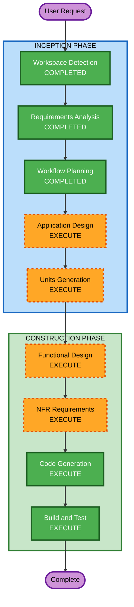

# Execution Plan - CRM Lead Management POC

## Detailed Analysis Summary

### Change Impact Assessment
- **User-facing changes**: Yes - New frontend applications (Appsmith + Budibase) with dynamic form rendering
- **Structural changes**: Yes - Multi-component architecture (Workflow Engine + Domain Service + 2 Frontend platforms)
- **Data model changes**: Yes - Lead entity model, form schema model, user/staff model
- **API changes**: Yes - 6 new REST API endpoints on Spring Boot domain service
- **NFR impact**: Yes - PBT testing requirements, Docker deployment, workflow hot-deploy

### Risk Assessment
- **Risk Level**: Medium
- **Rollback Complexity**: Easy (POC, no production data)
- **Testing Complexity**: Moderate (multi-component integration, PBT for business logic)

---

## Workflow Visualization



### Text Alternative
```
INCEPTION PHASE:
  1. Workspace Detection ........... COMPLETED
  2. Requirements Analysis ......... COMPLETED
  3. User Stories .................. SKIP
  4. Workflow Planning ............. COMPLETED
  5. Application Design ........... EXECUTE
  6. Units Generation ............. EXECUTE

CONSTRUCTION PHASE:
  7. Functional Design ............ EXECUTE (per-unit)
  8. NFR Requirements ............. EXECUTE (per-unit)
  9. NFR Design ................... SKIP
  10. Infrastructure Design ....... SKIP
  11. Code Generation ............. EXECUTE (per-unit, ALWAYS)
  12. Build and Test .............. EXECUTE (ALWAYS)
```

---

## Phases to Execute

### 🔵 INCEPTION PHASE
- [x] Workspace Detection (COMPLETED)
- [x] Requirements Analysis (COMPLETED)
- [ ] User Stories - **SKIP**
  - **Rationale**: POC scope, single user type (no auth), clear requirements from PDD spec. User stories would not add significant value.
- [x] Workflow Planning (IN PROGRESS)
- [ ] Application Design - **EXECUTE**
  - **Rationale**: Multiple new components needed (Domain Service, Workflow definitions, Form Schema service). Component methods, service boundaries, and API contracts need definition before implementation.
- [ ] Units Generation - **EXECUTE**
  - **Rationale**: System decomposes into 4 distinct units: Backend Domain Service, Camunda BPMN Processes, Appsmith Frontend, Budibase Frontend. Each unit has different tech stack and can be developed with clear boundaries.

### 🟢 CONSTRUCTION PHASE (Per-Unit)
- [ ] Functional Design - **EXECUTE**
  - **Rationale**: Complex business logic (allocation algorithm, state machine, dynamic form resolution) requires detailed design before code generation. PBT-01 requires property identification during this stage.
- [ ] NFR Requirements - **EXECUTE**
  - **Rationale**: PBT framework selection (jqwik) needs formal documentation. Docker deployment stack needs specification. PBT-09 requires framework selection at this stage.
- [ ] NFR Design - **SKIP**
  - **Rationale**: POC scope - no complex NFR patterns needed. Docker compose is straightforward. No performance optimization or security patterns required.
- [ ] Infrastructure Design - **SKIP**
  - **Rationale**: POC runs locally on Docker. No cloud infrastructure, no IaC needed. Docker compose file is sufficient and will be part of code generation.
- [ ] Code Generation - **EXECUTE** (ALWAYS)
  - **Rationale**: Implementation planning and code generation for all units.
- [ ] Build and Test - **EXECUTE** (ALWAYS)
  - **Rationale**: Build instructions, test execution (including PBT), integration verification.

---

## Proposed Units of Work

| Unit | Technology | Scope | Dependencies |
|---|---|---|---|
| **Unit 1: Domain Service** | Java Spring Boot + Camunda Zeebe Client | REST APIs + Job Workers + Form Schema + Data Layer | Camunda 8 running |
| **Unit 2: BPMN Processes** | Camunda Modeler / BPMN XML | Lead lifecycle workflow + User task definitions | Unit 1 (job workers) |
| **Unit 3: Appsmith Frontend** | Appsmith (lowcode) | Dynamic form rendering + Lead management UI | Unit 1 (REST APIs) |
| **Unit 4: Budibase Frontend** | Budibase (lowcode) | Same functionality as Unit 3 | Unit 1 (REST APIs) |

### Unit Dependency Graph
```
Unit 2 (BPMN) ----+
                   |
                   v
Unit 1 (Domain Service) <---- Unit 3 (Appsmith)
                   ^
                   |
                   +--------- Unit 4 (Budibase)
```

**Build Order**: Unit 1 → Unit 2 → Unit 3 & Unit 4 (parallel)

---

## Estimated Timeline

| Phase | Estimated Effort |
|---|---|
| Application Design | 1 session |
| Units Generation | 1 session |
| Functional Design (per unit) | 1-2 sessions |
| NFR Requirements | 1 session |
| Code Generation (all units) | 3-4 sessions |
| Build and Test | 1-2 sessions |
| **Total** | **8-11 sessions** |

---

## Success Criteria

### Primary Goals
1. ✅ Camunda 8 workflow thay đổi BPMN → frontend phản ánh form mới (không redeploy)
2. ✅ Appsmith render dynamic form từ JSON schema thành công
3. ✅ Budibase render dynamic form từ JSON schema thành công
4. ✅ Lead lifecycle chạy end-to-end qua Camunda orchestration

### Quality Gates
- All PBT tests pass (allocation algorithm, form schema round-trip, state transitions)
- Docker compose stack khởi động thành công
- Cả 2 frontend platforms hoạt động với cùng backend
- Tài liệu so sánh platform hoàn chỉnh

### Key Deliverables
1. Source code (Spring Boot + BPMN + Appsmith + Budibase)
2. Docker compose configuration
3. BPMN process definitions
4. Form schema JSON samples
5. Architecture documentation
6. Platform comparison document
7. Demo script
